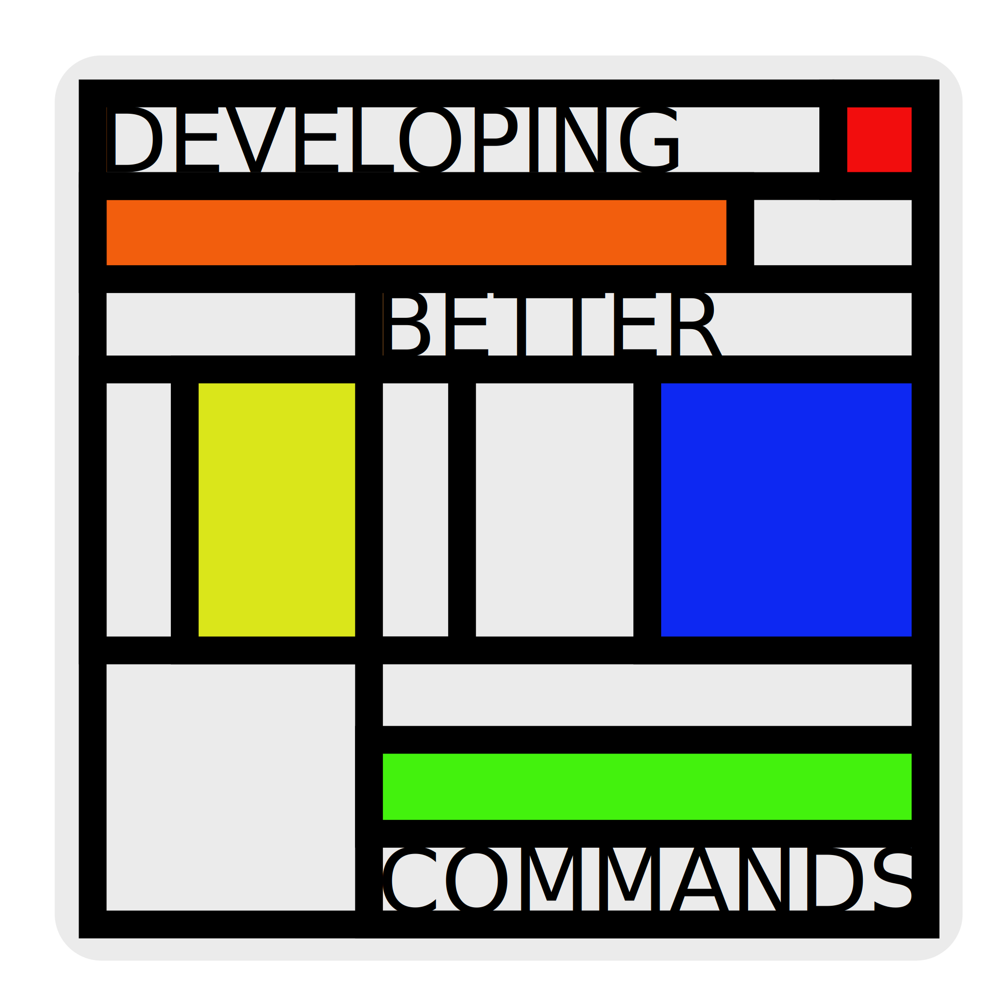

#__RUSTY COMMANDS__

    

## __Welcome!__

This repository is a collection of projects I've built along my journey learning Rust.
Most of the command-line tools here were inspired by exercises from various books I’ve read
— I’ll make sure to note which book each one comes from. Others were born from curiosity 
while exploring interesting concepts I came across, and I’ll mention the source of those ideas too.

Think of this as a personal log of small, demo-style CLI tools — a space where I document 
what I've learned and experimented with along the way. Hopefully,
you find something useful or inspiring here!
